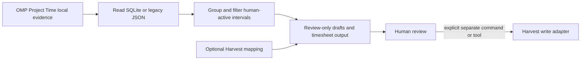

# Architecture

## Current Data Flow

The JavaScript integration owns the read-only path: it reads the Project Time log, groups intervals by local date and activity, and emits deterministic drafts or compact interactive totals. The interactive summary is advisory and review-marked. It does not change source evidence or create a destination entry.

The Ruby CLI owns the current Harvest write adapters. `time-off` and `work-entry` validate their inputs before calling Harvest. The approved OMP time-off tool invokes that CLI path. These explicit write surfaces are intentionally separate from the evidence transform.

## Components and Ownership

| Component | Responsibility | Detail authority |
| --- | --- | --- |
| `project-time.js` | Evidence loading, filtering, grouping, mapping projection, drafts, and timesheet formatting | Source comments and `test/project-time.test.js` |
| `index.js` | OMP command, completion, tool registration, interactive summary lifecycle, and CLI invocation | Source comments and `test/omp-plugin.test.js` |
| `lib/harvest_worklog.rb` and `lib/harvest_worklog/work_entry_cli.rb` | Harvest CLI validation and writes | Source comments and `test_harvest_worklog.rb` |
| `package.json` and gemspec | Published package metadata and included artifacts | Manifest files |

## Design Constraint

The local evidence transform is useful without Harvest credentials, assignments, or network access. Keep this read-only analytical path independent from any destination adapter. A future provider-neutral time-log record belongs between `Transform` and `Review`; an integration may consume a reviewed record, but must not become its source of truth.
